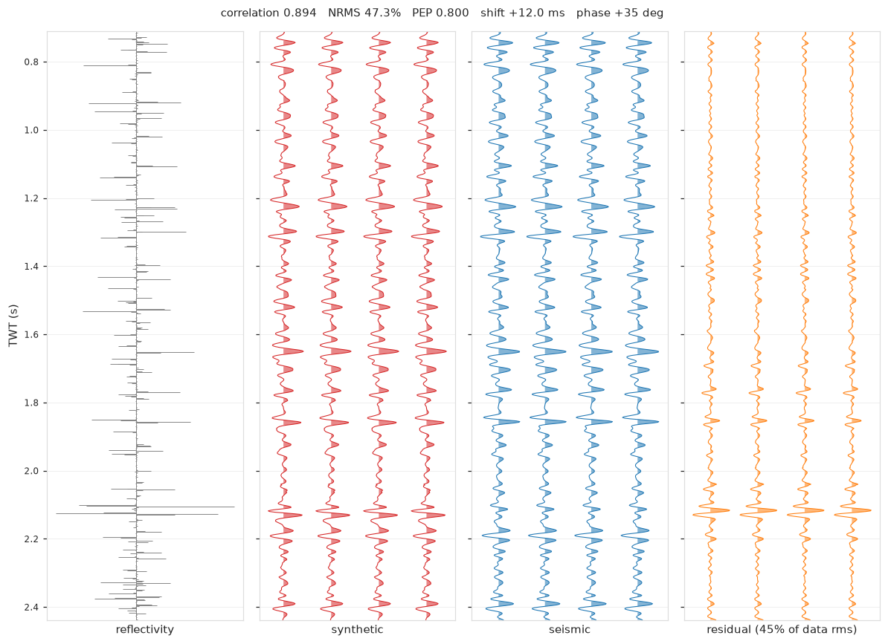
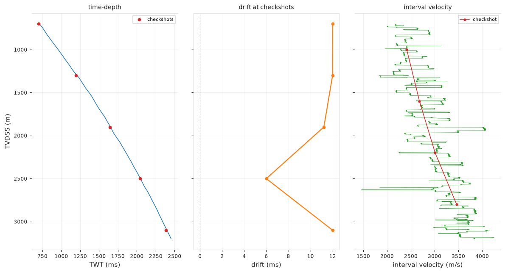
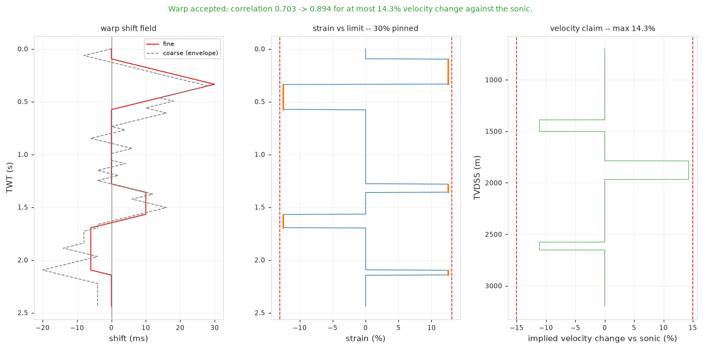

# SWT — Smart Seismic-to-Well Tie

A seismic-to-well tie engine with a deterministic geophysics core and an AI layer
on top.



*Reflectivity from the well, the synthetic it produces, the recorded seismic, and
what is left over. The residual is drawn at the same amplitude scale as the data,
so its size means something.*

---

## What problem does this solve?

A well gives you rock properties against **depth**. Seismic gives you reflections
against **time**. Before you can use them together — map a reservoir, convert a
horizon to depth, predict what a nearby well will hit — you have to establish
which depth corresponds to which time. That correspondence is a **well tie**, and
it is the join on which most quantitative interpretation rests.

The tie is made by building a *synthetic seismogram* from the well and aligning it
with the recorded seismic:

```
   sonic + density log
        │
        ├─ velocity × density ─────────────►  acoustic impedance
        │                                              │
        ├─ integrate the sonic ─────────────►  depth-to-time curve
        │  (calibrated to checkshots)                  │
        │                                              ▼
        │                                      reflection coefficients
        │                                              │
        └─ estimate the wavelet ──────────►  convolve  ▼
                                                   synthetic
                                                       │
                                            compare ◄──┴──►  recorded seismic
                                                       │
                                              adjust and repeat
```

**Why software for this?** Because the alignment step is judged by a correlation
coefficient, and *a correlation coefficient is exactly the number a subtly broken
pipeline will maximise*. Three separate defects found while building this produced
correlations above 0.99 on time-depth curves that were badly wrong. So the design
principle throughout is:

> The physics is deterministic and must be exactly right. The AI makes it *fast*
> and *honest* — it does not make it *correct*.

An auto-tie that reaches 0.95 by stretching the well 40% is a worse answer than a
manual tie at 0.7, and this software is built to say so.

---

## Status

All five milestones complete. **235 tests.**

| Milestone | State |
|---|---|
| **M0** Scaffolding, forward model, test harness | done |
| **M1** Deterministic tie, validated against ground truth | done |
| **M2** Streamlit interface | done |
| **M3** Auto-tie: constrained warping behind a velocity guardrail | done |
| **M4** Uncertainty quantification | done |
| **M5** Claude copilot over the engine | done |

Deviated-well support (TVDSS axis, path-following extraction) is also in.

**Not yet done:** no complete tie has run on real field data — every result so far
is synthetic. And the copilot's live API call is untested for want of credentials.
Both are called out honestly below.

---

## Getting started

New to the project? **[`docs/GETTING_STARTED.md`](docs/GETTING_STARTED.md)** is a
complete walkthrough from installing Python onwards.

The short version:

```bash
git clone https://github.com/kamranabbas20/SWT.git
cd SWT
git checkout claude/ai-seismic-well-tie-wmezk7
pip install -e ".[dev,app]"

python3 examples/demo_tie.py     # headless demo, ends with PASS
python3 -m pytest -q             # 235 tests, ~3 minutes
streamlit run app/streamlit_app.py
```

The app opens on a **synthetic case builder**: choose a time shift, a wavelet
phase, a signal-to-noise ratio, how many cycle skips to inject, then run the
pipeline and watch each stage. Because a synthetic case knows its own answer, the
header shows an **error vs truth** metric beside the correlation — and the two
disagree more often than is comfortable, which is the point of showing both.

---

## What the code does, module by module

```
swt/
├── units.py          unit detection and conversion
├── trace.py          a seismic trace on a uniform time axis
├── forward.py        the synthetic earth with a known answer
├── session.py        the one mutable tie state
│
├── io/               reading files
│   ├── las.py        well logs
│   ├── segy.py       seismic volumes, and extraction at/along a well
│   ├── checkshot.py  time-depth surveys
│   └── deviation.py  well paths
│
├── logs/condition.py log cleaning
├── petro/elastic.py  impedance and reflectivity
├── timedepth/        the depth-to-time relationship
├── wavelet/          wavelet estimation
├── synth/            building the synthetic
├── tie/              alignment: shift, phase, warp, guardrail
├── qc/               quality metrics and their significance
├── uq/ensemble.py    uncertainty
├── viz/panels.py     the plots
└── copilot/          Claude's tool surface over the engine
```

### The core, in pipeline order

**`swt.units`** — Converts µs/ft to µs/m, feet to metres, g/cc to kg/m³. It
**refuses to guess**: an unrecognised unit raises rather than defaults. A sonic
log read as µs/m when it is really µs/ft gives a time-depth curve wrong by a
factor of 3.28 that still looks entirely plausible.

**`swt.io`** — Readers for the four file types a tie needs. `las.py` handles
mnemonic aliases (`DT`, `DTCO`, `AC`…) and null conventions. `segy.py` reads
seismic and reports the geometry *before* using it, because trace headers are
wrong often enough — bad coordinate scalars, swapped X/Y, missing geometry — that
trusting them silently extracts the wrong trace. `deviation.py` computes the well
path by minimum curvature and converts measured depth to true vertical depth.

**`swt.logs.condition`** — Despiking, cycle-skip detection, bad-hole flagging, gap
filling. **Nothing is silently edited**: every routine returns the corrected log
*and* a report of what it changed and where. A single 4 m cycle skip adds a few
milliseconds to every sample below it and tilts the whole tie.



**`swt.timedepth`** — Integrates the sonic into a time-depth curve and calibrates
it onto checkshots via a drift curve. Enforces one hard invariant: **time must
increase strictly with depth**. A non-monotonic time-depth curve is not merely
inaccurate, it is meaningless, and it corrupts everything downstream while looking
fine. Also handles the interval between the seismic datum and the top of the log —
where most bad ties are actually born.

**`swt.petro.elastic`** — Impedance (velocity × density), normal-incidence
reflection coefficients, and Backus averaging to upscale a log to seismic
resolution.

**`swt.synth`** — Converts the reflectivity from depth to time and convolves it
with the wavelet. The depth-to-time resampling is the most important twenty lines
in the package; see below.

**`swt.wavelet`** — Three estimators. Ricker and Ormsby for a first look;
*statistical*, from the seismic autocorrelation, which needs no time-depth model
and so works before the tie exists; and *deterministic* least-squares, which
recovers amplitude and phase together but presupposes a roughly correct tie.

**`swt.tie`** — The alignment. Bulk shift, constant-phase scan, and the iteration
loop; then constrained warping and the guardrail that decides whether a warp is
admissible.

**`swt.qc`** — Correlation, NRMS, PEP — and, critically, whether any of them is
*statistically significant* for the window and bandwidth measured over.

**`swt.uq.ensemble`** — Re-runs the whole tie over sampled interpreter choices and
reports a corridor and a per-horizon tolerance in milliseconds, rather than a
single curve stated as though it were a measurement.

**`swt.forward`** — Generates a synthetic earth whose true time-depth curve,
wavelet and time shift are all known. This is the test oracle, and the reason the
rest can be trusted.

**`swt.session`** — One mutable `TieSession` holding the state of a tie. It is the
seam between the core and everything above: the interface drives it, and the
copilot drives *the same methods*. Every method returns compact JSON (no arrays),
and every change is journalled.

---

## Six things this does that most well-tie code does not

**1. Significance testing.** A seismic trace is band-limited, so a 200 ms window of
10–50 Hz data holds roughly 16 independent numbers, not 100. Correlating two random
band-limited series of that length gives ~0.5 routinely. `swt.qc.significance`
computes the chance level for the *actual* window and bandwidth, so a tie at 0.6
over a short narrowband window is reported as **not significant** rather than
coloured green.

**2. Correct depth→time resampling.** Reading impedance at each 2 ms tick is
decimation without an anti-alias filter: it aliases every thin bed into the seismic
band and changes the reflectivity spectrum, invisibly. `swt.synth.resample`
averages impedance over each output bin instead — an exact boxcar low-pass, in
closed form. The tests show the naive route carrying **>50× the energy it should**.

**3. Phase-blind coarse alignment.** The first shift is found on the analytic-signal
envelope, not the trace. A trace-domain correlation against data carrying 180° of
residual phase locks onto the wrong half-cycle and turns a phase error into a time
error that no later phase scan can undo.

**4. The wavelet may not hide a static.** A 128 ms least-squares wavelet can shift
its own energy several milliseconds to fit a misaligned synthetic. The loop then
converges, the next shift search finds nothing, and the time-depth is quietly
wrong. Every deterministic wavelet is recentred and its offset pushed back into
the time-depth model, where it stays visible.



*A warp is judged on the third panel — the velocity change it claims against the
sonic — and on the second, which shows whether it reached that claim or was merely
clipped to it.*

**5. A warp must earn its place.** Warping is where an auto-tie stops being
trustworthy: a bulk shift has one free parameter, a warp has one *per sample*, and
with that freedom correlation stops being evidence. So a warp is converted back
into the velocity change it claims against the sonic and must pass three separate
tests — the claim is plausible (≤15% by default), the warp *reached* that claim
rather than being clipped to it, and it buys enough correlation to justify the
freedom. **A rejected warp is discarded even when it correlates better.** Measured
outcome: 0 of 34 forward-modelled cases degraded.

**6. Uncertainty that is tested for calibration.** An 80% corridor must contain the
truth about 80% of the time, or it is a false statement rather than a conservative
one. Measured across cases: **0.815 against a nominal 0.80**.

Every one of these came out of the ground-truth tests, not from inspection. Three
were live bugs producing high correlations on wrong answers.

---

## Deviated wells

A deviated well breaks a tie in two independent ways, and both are silent.

The log is recorded against **measured depth**; the seismic is indexed by **true
vertical depth**. In a well with 800 m of departure those differ by hundreds of
metres, and a sonic integrated against MD stretches the time-depth curve by exactly
that difference. Nothing downstream flags it. The tests demonstrate this rather
than assert it: on an isolated case, MD integration is 150+ ms out where TVDSS
integration is exact.

And the well is **not under its wellhead**. `extract_along_path` assembles the
trace sample by sample — at each output time the well is at some depth, hence some
(x, y), and the amplitude comes from the trace nearest *that* point. The
circularity (knowing where the well is at time *t* needs the time-depth model the
tie produces) is handled by iterating, not by pretending: extract, tie, re-extract.

---

## The copilot

`swt.copilot` wires Claude (`claude-opus-5`) to a session through **the same
methods the interface calls** — no second implementation to drift out of step, and
no path by which the model touches a numpy array. Fifteen tools: nine read-only,
six that change the tie.

Its job is diagnosis, not narration. A dashboard already shows every number it can
see; what it adds is *"correlation 0.42, the drift steps 8 ms at 2100 m and the
sonic doubles over 2080–2140 m — that reads as a cycle skip, not geology."*

Two things are enforced rather than requested:

- **Mutating tools are gated.** By default it can look but not touch; a refused
  call returns an explanation it must relay rather than retry. The engine's
  guardrails still apply on top, so it cannot exceed the velocity limit or invert
  the time-depth even with permission.
- **Every refusal is logged.** A denied call changes nothing, so the journal never
  sees it — but what the copilot *wanted* to do belongs in the audit trail.

Set `ANTHROPIC_API_KEY` to use it. Everything else works without it.

> **Unverified:** the tool surface, the gate and the loop are tested against a stub
> client that executes real tools against a real session, but **no request has ever
> been made to the live API** — this was developed without credentials. Treat
> `Copilot.ask` as unproven until it has run once with a key.

---

## Testing

235 tests, in seven tiers:

| File | What it protects |
|---|---|
| `test_ground_truth.py` | That a tie lands where the forward model put it |
| `test_invariants.py` | The guarantees the rest of the package relies on |
| `test_session.py` | The tool-surface contract and that every plot builds |
| `test_guardrail.py` | The velocity arithmetic, against hand-built warps |
| `test_autotie.py` | That warping never degrades the time-depth |
| `test_uq.py` | That the uncertainty corridor is *calibrated* |
| `test_copilot.py` | The tool surface, permit gate and loop |
| `test_deviated.py` | The survey inverse and path-following extraction |

The ground-truth tier is the one that matters. A pipeline with a sign error or a
phase/time confusion still reports a high correlation, because a high correlation
is what it optimised for. Only ground truth distinguishes *tied well* from *tied
well to the wrong place*.

---

## Data

Development runs against synthetic data with a known answer — deliberately, not as
a workaround. On real data the true time-depth curve is unknown, so a tie can only
be judged by a correlation coefficient, and that is the number a broken pipeline
maximises. The forward model knows the answer, so the tests can ask whether the tie
*landed in the right place*.

Real data is a format smoke test. See [`data/README.md`](data/README.md) for what
is reachable and how to add F3 or Volve.

---

## Design notes

[`docs/PLAN.md`](docs/PLAN.md) is the full design document and running record —
what was planned, what was built, and what each milestone's tests actually found,
including the defects and the measurements behind each tuned threshold.
